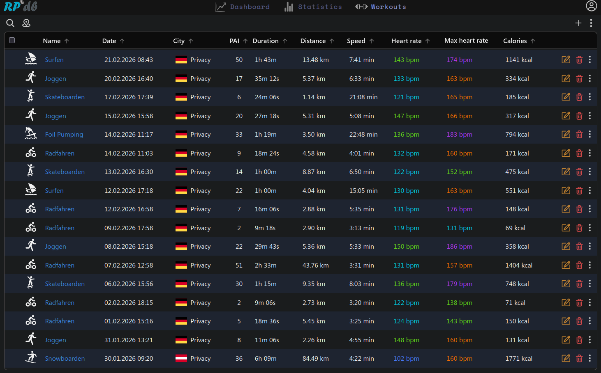
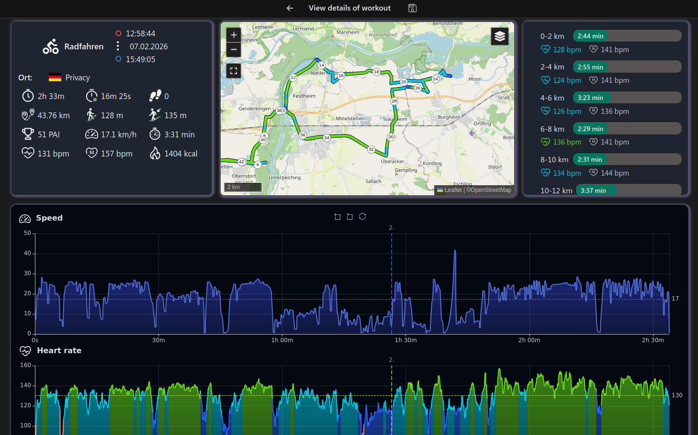
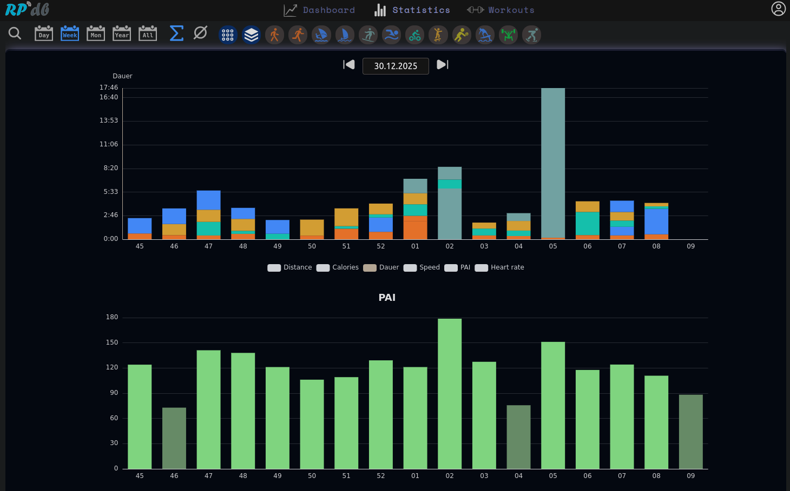
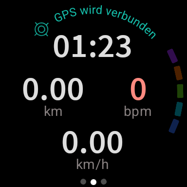
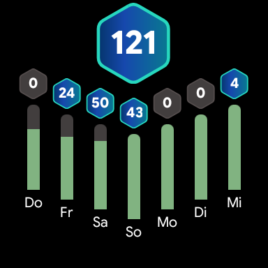
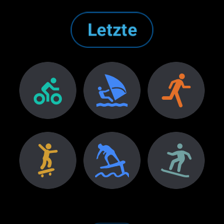

# RPout

A self-hosted workout tracking application for GPX based activities.

Workouts can be viewed and managed through a web user interface. 
A Wear OS app is also available to track workouts directly on your smartwatch and upload them to the server. An Android phone is required for the initial setup.

## Features

The server provides the following features:

- Uploading and parsing of *GPX* and *TXC* files
- Visualization of workout metrics (graphs): *Speed, Heartrate, Elevation*
- Step tracking
- Calculation of an activity score *(known as PAI - Personal Activity Intelligence)*
- Downsampling and merging of activities
- Visualization of metrics over time
- Automatic tagging of activities based on location and duration

We also provide a WearOS app to track your workouts and upload it directly to the server:

- Workout tracking
- Step tracking

## Screenshots






### WearOS





## Getting started

The recommended installation method is Kubernetes, but other options are available.

### Installation with Podman

You need podman installed on your system. We currently do not provide a prebuilt server image, so the container needs to be built locally.

```
make version && make build

podman run --detach --name "rpout-db" \
	--env MARIADB_ROOT_PASSWORD=changeit \
	-p 3306:3306 docker.io/mariadb:11.3

# Copy example secrets
cp ./scripts/_example_secrets ./scripts/secrets

# Create sample database
# Note: This can take up to 5 minutes because static data is generated
make init-container-db

# Create a new user
make create-user

make run-container
```


### Installation with kubernets

Runnuning RPout in Kubernetes is fully supported using *helm*. See [values.yaml](helm/values.yaml) for configuration options.

```
helm template ./helm
```

### Locale development

```
make install-dev && make install-js && make install-css

# Rebuild JS/TS modules after changes
make modules

# Run the app locally using the configured environment
# See "example_secrets" for configuration
make run
```


### Create user

A new user can only be created over the CLI.

```
./workout user create
```

After creating a user, it is important to update the profile in the settings so that activity indicators and calorie calculations work correctly.
Alternatively, you can use the `allFields` flag to specify all properties directly during creation.

## Known issues

* Leaflet tooltip stuck while panning: [Is Fixed in main](https://github.com/Leaflet/Leaflet/pull/9154)

## Support the project

* 🌟 Star this repository: This is the easiest way to support and costs nothing
* 🪲 Report bugs: Report any bugs you find on the issue tracker
* 🪙 Sponsorship: You can support the project financially with [PayPal](https://www.paypal.com/donate/?hosted_button_id=WTHCR7HLYEFDG)
